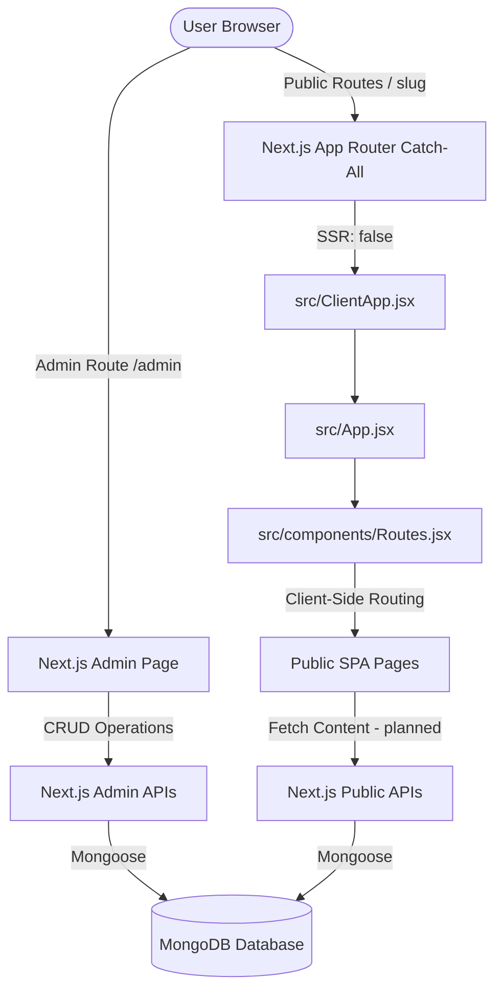

# GroupMappers Frontend & CMS System Guide

This guide describes the architecture, layout, database design, API endpoints, and development guidelines for the GroupMappers website and CMS. It is designed to help developers and LLMs quickly understand the system and make informed technical and design decisions.

---

## 1. Architectural Overview

The application uses a **hybrid architecture** combining Next.js App Router and a single-page React app (originally built with Vite).



* **Backend / API / Admin Layer**: Built using Next.js App Router.
  * Hosted endpoints under `/app/api/...`.
  * Administrative interface located at `/app/admin/page.jsx` (which operates as a client component).
* **Public Site Layer**: A React Single Page Application (SPA) using client-side routing (`react-router-dom`).
  * Loaded in Next.js using a catch-all route `app/[[...slug]]/page.jsx` which dynamically imports `src/ClientApp.jsx` with **SSR disabled** (`ssr: false`).
  * Managed by `src/components/Routes.jsx`.

---

## 2. Directory Structure

Here is a map of the important directories and files in this workspace:

```
d:/groupmappers-website/
├── app/                        # Next.js App Router
│   ├── [[...slug]]/            # Public Catch-all SPA route
│   │   └── page.jsx            # Renders <ClientApp />
│   ├── admin/                  # CMS Admin Dashboard
│   │   └── page.jsx            # React CMS frontend for administrators
│   └── api/                    # Next.js Serverless API endpoints
│       ├── admin/
│       │   ├── content/        # CRUD operations for CMS contents
│       │   │   ├── route.js    # GET (list) and POST (create) content
│       │   │   └── [id]/
│       │   │       └── route.js # PATCH (update) and DELETE content
│       │   └── seed/           # Seed route
│       │       └── route.js    # Seeds database from local JSON data
│       └── public/
│           └── content/        # Public API endpoints
│               ├── route.js    # GET all published contents
│               └── [type]/[slug]/
│                   └── route.js # GET single published content item
│
├── src/                        # Core React SPA codebase
│   ├── App.css
│   ├── App.jsx                 # Entry component (checks loading, wraps providers)
│   ├── ClientApp.jsx           # Wraps App.jsx with next/dynamic (ssr: false)
│   ├── index.css               # Main styling sheet
│   ├── main.jsx                # Legacy Vite entry point
│   │
│   ├── assets/
│   │   ├── data/               # Local JSON data files (used for static data and seeding)
│   │   │   ├── activity-data.json
│   │   │   ├── news-data.json
│   │   │   ├── profile.json
│   │   │   └── rabies-data.json
│   │   └── images/             # Static images
│   │
│   ├── components/             # Reusable UI components & pages
│   │   ├── Footer.jsx          # Site Footer
│   │   ├── Header.jsx          # Site Header / Navbar
│   │   ├── LoadScreen.jsx      # Loading Splash Screen
│   │   ├── Routes.jsx          # client-side Routing Map (react-router-dom)
│   │   └── pages/              # Public Page Layouts
│   │       ├── Home.jsx        # Landing Page
│   │       ├── News.jsx        # News details renderer
│   │       ├── Activities.jsx  # Activity details renderer
│   │       ├── Profile.jsx     # Team member details renderer
│   │       ├── Rabies.jsx      # Rabies page details renderer
│   │       ├── ContactUs.jsx
│   │       ├── DonateUs.jsx
│   │       ├── aboutUs/        # About Us section pages
│   │       │   ├── Gallery.jsx # Image Gallery (utilizing lightgallery)
│   │       │   └── Team.jsx    # Hardcoded team directory page
│   │       └── projects/       # Disease & non-disease project descriptions
│   │
│   ├── lib/                    # Shared Utility Modules
│   │   ├── cmsAuth.js          # Admin Token Verification Middleware
│   │   └── mongodb.js          # MongoDB Mongoose Connection Pooler
│   │
│   └── models/                 # Mongoose Database Models
│       ├── ContentItem.js      # Primary CMS Schema (all types)
│       └── homeSchema.js       # Unused/Legacy Schema (Home stats/news list)
│
├── package.json                # Dependencies and next scripts
├── next.config.js              # Next.js configurations
└── vite.config.js              # Legacy Vite configurations (if applicable)
```

---

## 3. Technology Stack & Design System

The application mixes several UI libraries. Pay extra attention to styling paradigms when editing pages.

* **React 19** & **Next.js 16**
* **Styling**:
  * **Tailwind CSS v4** (imported in `src/index.css` via `@tailwindcss/vite` and `@tailwindcss/postcss`).
  * **Material UI (MUI)** (e.g., `@mui/material`, `@mui/icons-material` Accordions, Buttons, icons).
  * **Mantine Core** (`@mantine/core` v8, used for wrapper themes).
  * **Bootstrap / React Bootstrap** (legacy UI layout components).
* **Dynamic Media & Visualization**:
  * **Swiper**: Used for image carousels/sliders (e.g., `Slider1` and `Slider2` in `Home.jsx`).
  * **Lightgallery**: Dynamic photo grid popups (e.g., `Gallery.jsx`).
  * **Leaflet / React Leaflet**: Interactive maps for geographic data.
  * **Framer Motion**: Smooth entry animations and micro-interactions.

---

## 4. Database Models & Schema Design

### 4.1 ContentItem (`src/models/ContentItem.js`)
This is the **primary schema** for all CMS records. Instead of separate collections per entity, a single flexible schema is used, differentiated by the `type` field.

| Field | Type | Description |
|---|---|---|
| `type` | String | **Required, Indexed**. One of: `page`, `bytheNumbers`, `news`, `project`, `activity`, `teamMember`, `galleryItem`, `rabiesPage`, `navigation`, `siteSetting` |
| `slug` | String | **Required**. Lowercase URL identifier. Indexed uniquely in combination with `type`. |
| `title` | String | **Required**. Title of the content item. |
| `status` | String | `draft`, `published`, or `archived`. (Default: `draft`) |
| `summary` | String | Optional description/subtitle. |
| `body` | String | Main page contents (usually formatted as Markdown). |
| `images` | [String] | Array of image URLs. |
| `blocks` | [Mixed] | Flexibly structured sub-components (dynamic layouts). |
| `metadata` | Mixed | Schema-less field for custom inputs (e.g. designation, emails, legacy keys). |
| `seo` | Object | Nested `{ title, description }` structure. |
| `publishedAt`| Date | Timestamp when the content was published. |

### 4.2 Home Schema (`src/models/homeSchema.js`)
* Currently **unused** or **legacy**; its goal was to store homepage specific records (`bytheNumbers` stats and `latestNews` references).
* Developers should ideally standardise around the unified `ContentItem` model for all CMS storage.

---

## 5. API Endpoints

All endpoints verify headers or query parameters and return standard JSON.

### 5.1 Admin Endpoints
*Require `x-admin-token` header matching the server's `CMS_ADMIN_TOKEN` env variable.*

* `GET /api/admin/content?type=[type]` - List content items (optionally filtered by type).
* `POST /api/admin/content` - Create a new `ContentItem`.
* `PATCH /api/admin/content/[id]` - Edit an existing `ContentItem`.
* `DELETE /api/admin/content/[id]` - Remove a `ContentItem`.
* `POST /api/admin/seed` - Triggers normalization. It reads local assets `src/assets/data/*.json` and upserts them as `ContentItem` records (`news`, `activity`, `teamMember`, `rabiesPage`) to pre-populate the database.

### 5.2 Public Endpoints
*Public access; read-only.*

* `GET /api/public/content?type=[type]&limit=[number]` - Get a list of published content items.
* `GET /api/public/content/[type]/[slug]` - Fetch a single published content item.

---

## 6. Implementation Status & Next Steps

Currently, the system is in a **transition phase** from a purely static website to a dynamic CMS-driven portal:

```
[Seeded Database] <── (Admin Token) ── [Admin Dashboard (app/admin)]
                                           ▲
                                           │ (Manual Seeding)
[Local JSON Files (src/assets/data)] ──────┘
         │
         ├─── (Direct Static Import) ───► [Public Site Pages (News, Profile, Activities)]
         └─── (Hardcoded inside file) ──► [Home.jsx, Gallery.jsx]
```

### 1. The Core Tasks (Work in progress)
* **Transition Public Pages to fetch dynamically**:
  * Currently, pages like `News.jsx`, `Activities.jsx`, `Profile.jsx`, and `Rabies.jsx` import the local data `.json` files directly.
  * These need to be converted to use standard React `useEffect` + `fetch` to read from `/api/public/content/[type]/[slug]`.
* **Dynamic Gallery page**:
  * Convert `Gallery.jsx` to fetch `galleryItem` list from `/api/public/content?type=galleryItem`.
* **Dynamic Team listing page**:
  * Convert `Team.jsx` to fetch `teamMember` list from `/api/public/content?type=teamMember` rather than hardcoding team member info inside `Team.jsx`.
* **Homepage Integration**:
  * Transition "Latest News" grid on `Home.jsx` to fetch the top list of `news` types dynamically.
  * Transition "By the number" statistics grid on `Home.jsx` to fetch `bytheNumbers` types from the database.

---

## 7. Guidelines for LLMs & Developers

If you are an LLM working on this project, follow these instructions to keep the code clean and functional:

1. **Routing Strategy**:
   * The public site is a client-side SPA. **Do not create Next.js pages for public subpages** (e.g., do not create `/app/news/page.jsx`).
   * Instead, write standard React components in `src/components/pages/` and register their path in `src/components/Routes.jsx`.
2. **Database Queries**:
   * Always import `connectMongo` from `@/lib/mongodb` and await it *before* running mongoose query methods in Next.js api routes.
   * Standardise queries using the `ContentItem` model.
3. **Data Fetching in Components**:
   * In public client pages (e.g. `src/components/pages/News.jsx`), use standard React fetching (`useState` + `useEffect`) to fetch from `/api/public/content/[type]/[slug]`.
   * Add robust loading screens (`LoadingScreen` component) and fallback error messaging if the API is down or database returned 404.
4. **CSS Styling**:
   * Use Tailwind CSS classes for custom layout or dynamic positioning.
   * If you need Mantine or MUI components, make sure they are nested within the correct Providers.
5. **Environment Configuration**:
   * Confirm that `.env.local` is set up with `MONGODB_URI` and `CMS_ADMIN_TOKEN`.
   * Never commit secrets to the repository.
